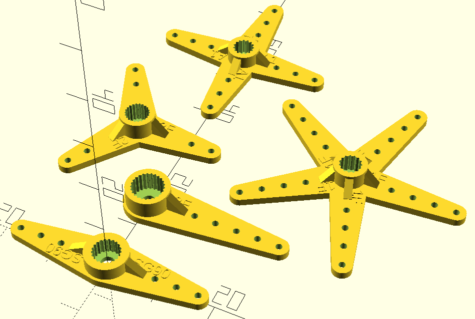
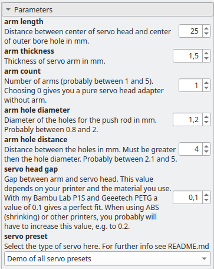

# customizable-servo-arm
A customizable servo-arm generator in OpenSCAD for generating servo-arm models for 3D-printing

## Description

A customizable OpenSCAD model to generate a servo arm that exactly fits your needs.

It is based on the work by [Paul Barrett](https://github.com/hugokernel/OpenSCAD_ServoArms) and [Charles Rincheval](https://www.thingiverse.com/thing:630862). I added the splines for SG90 and HITEC A1 servos, and reworked the layout of arm and support.

## Usage

In OpenSCAD select the desired parameters in the customizer window. If the customizer window is not visible, enable it by unslecting *Window* -> *Hide Customizer*.

Then render the servo arm and export as STL.

## Parameters

### arm length

Regular servo arms usually have a distance between center of servo head and center of outer bore hole of about 25mm to 30mm, arms for micro servos have 14.8mm.

### arm thickness

Regular servo arms usually have a thickness of 2mm, arms for micro servos have 1.5mm.

### arm count

Number of arms, probably between 1 and 5. Choosing 0 gives you a pure servo head adapter without arm.

### arm hole diameter

Regular servo arms usually have a hole diameter of 1.5mm, arms for micro servos have 0.9mm. You can adjust this to fit the diameter of your push rod. 

### arm hole distance

Regular servo arms usually have a hole distance of 5mm, arms for micro servos have 2.1mm.

### servo head gap

The gap between arm and servo head. This value depends on your printer and the material you use. With my Bambu Lab P1S and Geeetech PETG filament, a value of 0.1 gives a perfect fit. When using ABS (shrinking) or not-so-well-fine-tuned printers, you probably will have to increase this value.

## Servo splines

### Futaba 3F (25 teeth)

This is the most commonly used servo spline for "standard" servos. Futaba 3F is identical to Hitec H25T. A lot of servos from D-POWER and SAVOX use this spline, too.

* MG 996R

### Futaba 2F (21 teeth)

Micro servos like S3153, S3107, S117

* Futaba S3153 MG Digital
* Futaba S3107 Nano
* Turnigy TG9e

### Futaba 1F (15 teeth)

* ???

### HITEC A1 aka. A15T (15 teeth)

* ???

### SG90 (21 teeth)

This is for Micro Servos like the Tower Pro SG90 9g Micro Servo or MG90S Micro Servo.

## Further info

Some useful information about servo splines is found here:

* [ServoCity Glossary - Servo Splines](https://www.servocity.com/glossary#servo-splines)
* [Servo Spline Info](https://www.hepf.at/servo-spline-information/) (german)
* [Servo Horn Arm Spline Count and Inter Brand Compatibility](https://www.rcgroups.com/forums/showpost.php?p=13441675)
* [RC Servo Spline Chart](https://www.robotdigg.com/news/168/RC-Servo-Spline-Chart)

There seems to be no real specification for SG90 servo splines available, so some people tried to reverse engineer this spline:

* [Modelling a Servo Spline](https://community.robotshop.com/blog/show/modelling-a-servo-spline)
* [Spline Thieving Makes Hobby Servos Even More Useful](https://hackaday.com/2015/02/01/spline-thieving-makes-hobby-servos-even-more-useful/)
* [Servo Spline Adapters](http://projectsbyjb.blogspot.com/2014/11/servo-spline-adapters.html)

